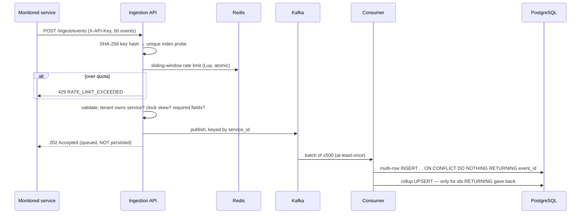
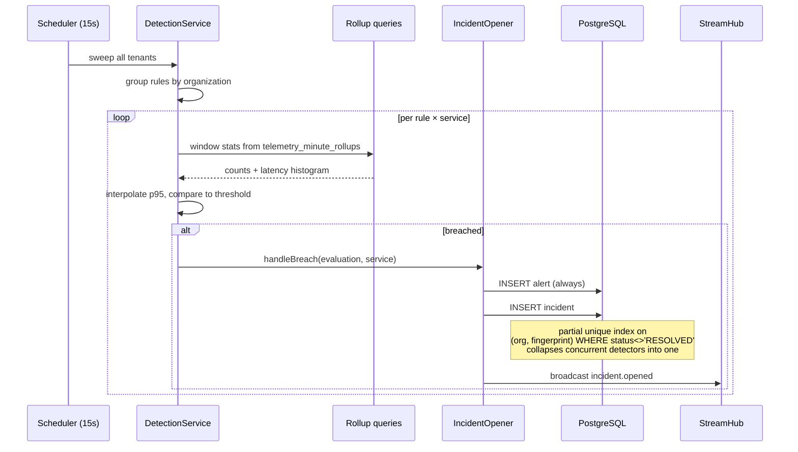
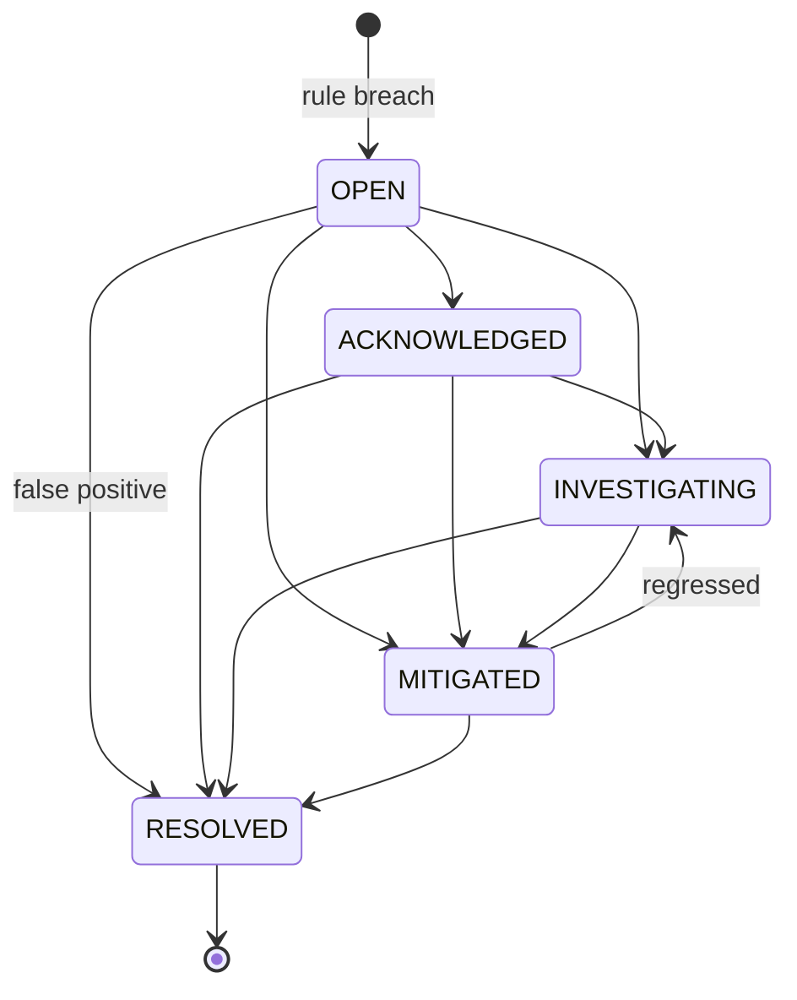
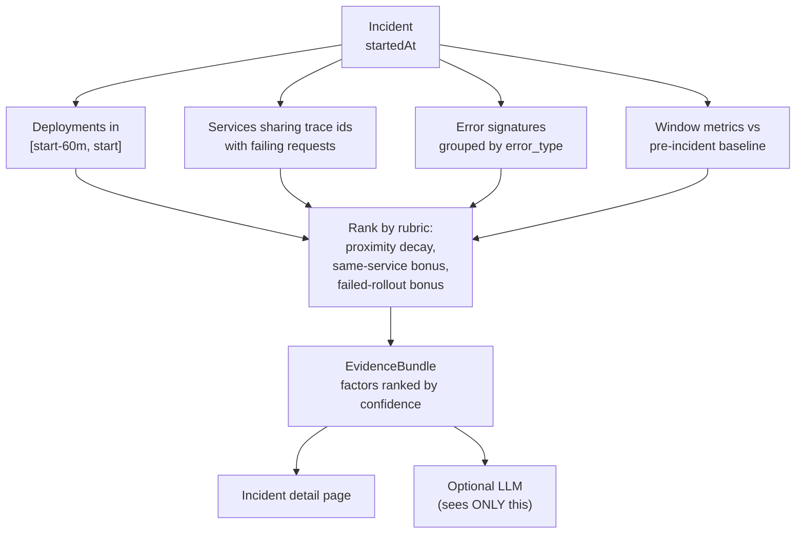
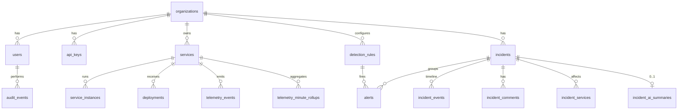

# Architecture

## Shape

One deployable Spring Boot application containing seven bounded modules, plus a Next.js frontend.
Modules own their entities and repositories and talk to each other through published interfaces and
Kafka topics — no module reads another's tables. Rationale and the conditions that would change it
are in [ADR-0001](docs/adr/ADR-0001-modular-monolith.md).

```
com.signalforge
├── platform/      errors, tenancy, correlation ids, security config, typed properties
├── iam/           organizations, users, roles, JWT + API keys, audit log
├── registry/      service registry, health status
├── telemetry/     ingestion, rate limiting, JDBC write path, rollups, read queries
├── messaging/     Kafka contracts, topic names, retry classification
├── detection/     rule evaluation, incident opening, dedup and cooldown
├── incident/      lifecycle, timeline, comments, alerts
├── correlation/   deterministic evidence gathering and ranking
├── deployment/    deployment tracking
├── notification/  SSE fan-out hub
└── ai/            optional Ollama summariser
```

## Request flows

### Telemetry ingestion — write path



The API does not write to PostgreSQL. Ingestion is the highest-volume path and gets hammered
exactly when the database is already struggling — during an incident, which is when this platform
must keep working.

### Detection and incident opening



### Incident lifecycle



`RESOLVED` is terminal. Re-opening would make time-to-resolve ambiguous and let one row represent
two distinct outages; a recurrence is a new incident, which the fingerprint index permits precisely
because it only constrains non-resolved rows.

### Correlation



Deterministic — no model, no statistics. Every score traces to a fact with a timestamp, so an
engineer can disagree and check.

## Data model



Twenty tables across two Flyway migrations. Conventions:

- **UUID primary keys**, except `telemetry_events` which uses `BIGSERIAL` — it is append-only, never
  referenced by foreign key, and a sequential key keeps the index dense.
- **`organization_id` is a real column on every tenant-scoped table**, not a join away. A join would
  make every read more expensive and every index less selective.
- **`timestamptz` everywhere.** Never `timestamp`.
- **`version` columns** where two humans can realistically collide — services and incidents.
- **CHECK constraints mirror the Java enums.** A bad value fails at the database, not just in code.

### The two tables that carry the design

**`telemetry_events`** — the volume. `UNIQUE (organization_id, event_id)` is what turns
at-least-once delivery into effectively-once behaviour. Hot fields (`latency_ms`, `status_code`,
`error_type`) are promoted out of the `metadata` jsonb so they can be indexed and aggregated
without per-row JSON parsing.

**`telemetry_minute_rollups`** — the read performance. A cumulative latency histogram with fixed
buckets, maintained incrementally on the write path. Measured at 754.8 ms → 0.040 ms against
`percentile_cont` on 2.15M rows, with p95 accurate to 0.09% and p50 off by 29%. Both numbers, and
why, are in [docs/benchmarks](docs/benchmarks/README.md).

## Tenant isolation

Three layers, all implemented:

1. **Token-derived tenant.** `organizationId` comes from a signed JWT claim. No endpoint accepts it
   as a path variable, query parameter or body field — there is no input to attack.
2. **Query-level scoping.** Every repository method touching a tenant-scoped table takes
   `organizationId` and puts it in the `WHERE` clause. Cross-tenant access returns 404, never 403,
   so resource existence is not disclosed.
3. **Row-level security in PostgreSQL** (`V4__row_level_security.sql`) — policies on 18
   tenant-scoped tables compare `organization_id` against the `signalforge.current_org` session
   setting, stamped by `TenantAwareDataSource` per connection and `TenantBinder` per transaction.
   The runtime connects as `signalforge_app`, a **non-owning, non-superuser** role; Flyway migrates
   as the owner. That split is load-bearing rather than cosmetic — PostgreSQL exempts superusers
   and table owners from RLS unconditionally, so the first version of this migration was silently
   decorative. Three schema-declared `SECURITY DEFINER` functions are the only bypasses, and a test
   asserts no fourth exists.

23 negative tests cover layers 1 and 2. `RowLevelSecurityIT` covers layer 3 by issuing raw SQL with
**no tenant predicate at all** — including reads by exact primary key — and asserting the database
returns nothing anyway.

## Failure behaviour

| Dependency | Behaviour | Rationale |
|---|---|---|
| **PostgreSQL down** | API returns 503; readiness fails, instance leaves the load balancer | It is the system of record; serving stale reads would be worse |
| **Redis down** | Rate limiting and login throttling **fail open**; Redis excluded from readiness | A cache outage must not become an authentication or observability outage |
| **Kafka down** | Ingestion returns 503 after a 5 s `max.block.ms`, not a 60 s hang | Fast, honest failure beats tying up request threads |
| **Consumer crash** | Offsets uncommitted → redelivery → idempotent write absorbs it | Proven by `TelemetryIdempotencyIT` |
| **Poison message** | Non-retryable classification → straight to `<topic>-dlt` | Retrying forever blocks the partition |
| **Ollama down/absent** | `available: false` with a reason; 200 not 503 | Optional by design; never on the detection path |

## Deliberate limitations

Stated here rather than discovered in review:

- **SSE is in-process.** Two API replicas each serve their own subscribers. The
  `notification-events` topic exists for the fix.
- **The detection scheduler is single-instance.** Two replicas would double the sweeps — correct,
  because dedup is a database index rather than an assumption of one evaluator, but wasteful.
- **`Incident.timeToDetect` is null for incidents opened before `V3`.** It is now measured from
  `signal_observed_at`, but rows predating that migration were never backfilled, because inventing
  a latency nobody measured is worse than reporting none.
- **Distributed tracing is configured but unverified** across the Kafka boundary.
