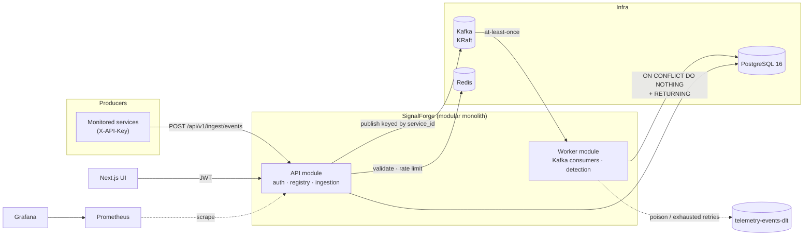

# SignalForge

**AI-Assisted Production Incident & Reliability Platform**

An event-driven platform that ingests service telemetry, detects abnormal behaviour, correlates
failures with recent deployments and shared traces, and produces evidence-backed incident
timelines — so an on-call engineer stops stitching together four dashboards during an outage.

Built with Java 21, Spring Boot 3.5, Apache Kafka, PostgreSQL 16, Redis and OpenTelemetry.
Runs entirely locally for **$0**: no paid cloud, no paid LLM API, no SaaS dependency.

---

> ## Build status — read this first
>
> Every capability described below as *implemented* has code and passing tests behind it. Nothing
> is claimed that is not built, and there are no fabricated benchmark numbers anywhere in this repo.
>
> **125 backend tests pass** — 37 unit + 88 integration, from a clean `mvn verify` against real
> PostgreSQL, Redis and Kafka via Testcontainers. **19 frontend unit tests pass** (Vitest); the
> frontend also typechecks, lints and builds.
>
> **Implemented and tested:** tenancy and RBAC, JWT + API-key auth, audit logging, service registry,
> telemetry ingestion with per-tenant rate limiting, the Kafka pipeline with idempotent consumers
> and dead-letter handling, the incident detection rules engine, the incident lifecycle API,
> deployment correlation and deterministic RCA, the Next.js frontend with live SSE updates,
> **PostgreSQL row-level security enforced by the database**, ArchUnit architecture rules, Grafana
> dashboards, the optional evidence-grounded Ollama assistant, and measured k6 benchmarks.
>
> **Not built, and deliberately not claimed:** automated failure-injection tests, the Playwright E2E
> specs (written, never executed), the MTTR A/B experiment (**so no MTTR number appears anywhere**),
> screenshots, and two frontend pages (Reliability Analytics, Organization Settings).
>
> See **[docs/STATUS.md](docs/STATUS.md)** for the precise line between the two.

---

## Why this exists

During an incident, engineers correlate by hand across application errors, HTTP latency, traces,
logs, Kafka consumer lag, database failures and deployment history — usually in separate systems.
That manual correlation is most of Mean Time to Resolution.

SignalForge centralises those signals and does the correlation deterministically: shared trace ids,
timeline proximity, common error signatures, and deployments that landed shortly before degradation.
An optional local LLM summarises **only the evidence that exists** — and is architecturally
incapable of blocking incident detection if it is unavailable.

## Architecture



**One deployable, seven modules, two runtime roles.** The `api` profile serves HTTP; the `worker`
profile runs Kafka consumers and the detection scheduler. Same jar, different scaling profile.
Rationale in [ADR-0001](docs/adr/ADR-0001-modular-monolith.md).

### The ingestion path, and why it is shaped that way

```
POST /api/v1/ingest/events
  → API-key auth (SHA-256 unique-index probe, not bcrypt — see ApiKey javadoc)
  → Redis sliding-window rate limit, charged per event not per request
  → validate (tenant-owned service? sane timestamp? required fields?)
  → publish to Kafka keyed by service_id
  → 202 Accepted          ← "durably queued", NOT "written to PostgreSQL"
        ↓ (asynchronous)
  Kafka consumer, batch of up to 500
  → chunked multi-row INSERT … ON CONFLICT DO NOTHING RETURNING event_id
  → per-minute rollups computed ONLY from the ids RETURNING gave back
```

The API deliberately does not write to PostgreSQL. Ingestion is the highest-volume path and gets
hammered precisely when the database is already struggling — during an incident, which is when
this platform most needs to keep working.

## Quick start

**Prerequisites:** Docker Desktop, and ~2 GB of free memory in the Docker VM.

```bash
git clone <this-repo> && cd signalforge
cp .env.example .env
```

Generate a real signing key — the application refuses to start on the placeholder:

```bash
printf 'SF_JWT_SECRET=%s\n' "$(openssl rand -base64 48)" >> .env
```

Bring up the stack:

```bash
docker compose up -d
```

| Service | URL | Notes |
|---|---|---|
| API | http://localhost:8099 | |
| Swagger UI | http://localhost:8099/swagger-ui.html | |
| Health | http://localhost:8099/actuator/health | |
| Prometheus | http://localhost:9099 | |
| Grafana | http://localhost:3011 | `admin` / `admin` |
| PostgreSQL | `localhost:5442` | |
| Redis | `localhost:6389` | |
| Kafka | `localhost:19092` | KRaft, no ZooKeeper |

Ports are deliberately offset from the usual defaults (5432/6379/9092/9090/3000/8080) so the stack
coexists with other local projects. Override any of them in `.env`.

### Try it

```bash
curl -s -X POST http://localhost:8099/api/v1/auth/register-organization \
  -H 'Content-Type: application/json' \
  -d '{"organizationName":"Acme Payments","organizationSlug":"acme",
       "adminEmail":"admin@acme.test","adminFullName":"Ada Admin",
       "adminPassword":"correct-horse-battery"}'
```

That returns an access token. Register a service, then post telemetry to
`POST /api/v1/ingest/events`. The full walkthrough is in
[docs/runbooks/local-walkthrough.md](docs/runbooks/local-walkthrough.md).

## Running the tests

The suite uses **Testcontainers with real PostgreSQL, real Redis and a real Kafka broker** — not
H2 and not `EmbeddedKafka`. This codebase depends on behaviour those substitutes do not reproduce:
partial unique indexes, `jsonb`, `ON CONFLICT … RETURNING`, the append-only audit trigger, and
consumer rebalancing.

```bash
cd backend && mvn verify
```

Requires Java 21 and a running Docker daemon. Run it from a clean `target/` — a stale
`surefire-reports/` is read as a current result, which is how a week-old failure briefly passed for
a live one here.

Frontend:

```bash
cd frontend && npm ci && npm test
```

`npm test` is Vitest, and it deliberately excludes `e2e/`. Those are Playwright specs that have
never been executed — see [docs/STATUS.md](docs/STATUS.md).

## What the tests actually prove

| Area | Test | What it establishes |
|---|---|---|
| Tenant isolation | `TenantIsolationIT` | Org A cannot read, modify or archive Org B's resources at either the HTTP or repository layer; an **ADMIN** of A gets nothing from B; foreign and nonexistent ids are indistinguishable (no existence oracle) |
| Authorization | `AuthorizationIT` | VIEWER cannot write; ENGINEER cannot administer; ADMIN inherits both; malformed and wrongly-signed tokens are rejected rather than silently treated as anonymous |
| Idempotency | `TelemetryIdempotencyIT` | Redelivered batches insert once; partial overlaps insert only what is new; **rollups are not double counted**; three concurrent threads on the same batch still produce one row per event; the same event id in a different tenant is a different event |
| Pipeline | `PipelineEndToEndIT` | HTTP → Kafka → consumer → PostgreSQL end to end through a real broker, and a replayed POST changes nothing |
| Correlation | `DeploymentCorrelationIT` | A closer deployment outranks a distant one; the failing service's own deploy outranks a peer's; a deploy *after* the incident is ignored; correlation measures from rollout completion; **an incident with no correlating evidence yields zero factors, not a guess**; every factor carries its evidence |
| AI guardrails | `IncidentAiServiceTest` | Disabled/unreachable/unparseable model all report unavailable rather than erroring; no model call is made when evidence is inconclusive; a cause naming a service absent from the evidence bundle is **discarded** |
| Live stream | `StreamHubTest` | Broadcasts never cross the tenant boundary; a dead subscriber is reaped and does not block delivery to healthy ones |
| Ingestion | `IngestionIT` | Cross-tenant service ids rejected; future timestamps rejected; batches charged per event so batching cannot bypass quota; 429 with `RATE_LIMIT_EXCEEDED`; one tenant's traffic does not consume another's quota |
| Detection | `DetectionEngineIT` | Rules fire above threshold and stay quiet below; a single failure in a quiet window does **not** page (min sample size); a sustained breach yields **one** incident across repeated sweeps but **one alert per firing**; cooldown suppresses flapping; severity escalates by service criticality; detection latency is measured, not zero; org B's rules never see org A's telemetry |
| Percentiles | `WindowStatsTest` | Histogram interpolation is correct and ordered; falls back to the observed maximum in the open-ended `+Inf` bucket rather than extrapolating; error stays inside one bucket width |
| Row-level security | `RowLevelSecurityIT` | Raw SQL with **no tenant predicate at all** — including `SELECT` by exact primary key — returns nothing; cross-tenant `INSERT` is blocked by `WITH CHECK`, and `UPDATE`/`DELETE` affect zero rows; only three `SECURITY DEFINER` bypasses exist and a test fails if a fourth appears |
| API client (frontend) | `lib/api.test.ts` | The organization id never appears in a URL or request body; a 401 refreshes **once** and replays with the new token; a second 401 gives up instead of recursing; concurrent 401s share one refresh; 403/404 are deliberately not retried |
| SSE reader (frontend) | `lib/stream.test.ts` | The token travels in a header, never the URL; a frame split mid-JSON across two chunks is delivered **exactly once**; two frames in one chunk both arrive; heartbeats are ignored; a malformed frame is dropped without tearing down the connection |
| Lifecycle | `IncidentLifecycleIT` | Full `OPEN→ACK→INVESTIGATING→MITIGATED→RESOLVED` path; `RESOLVED` is terminal; self-transitions and illegal moves return `INVALID_STATE_TRANSITION`; stale version returns 409; VIEWER is read-only; cross-tenant transition is 404 and leaves the incident untouched |

Two real bugs were found by these tests during development and are documented rather than
quietly fixed:

1. **Rollups double-counted on redelivery.** Rows were correctly suppressed by `ON CONFLICT`, but
   the per-minute aggregate was still computed from the input batch — so a replayed batch made a
   service appear to serve twice its traffic. Fixed by computing rollups from `RETURNING`.
   ([ADR-0007](docs/adr/ADR-0007-at-least-once-delivery.md))
2. **Dead-lettering did not actually work.** Deserialization happens inside `poll()`, *before* the
   listener runs, so `DefaultErrorHandler` never saw the failure and the container re-fetched the
   poison record forever. Fixed by wrapping the value deserializer in `ErrorHandlingDeserializer`.

## Security

- Bearer JWT (HS256) for humans; `X-API-Key` for machine ingestion. Refresh tokens cannot be used
  as access tokens.
- The application **refuses to start** on a short, missing or placeholder signing key.
- Wrong password and unknown account return an identical response, and unknown accounts still pay
  a bcrypt verification, so response time is not a user-enumeration oracle.
- bcrypt (cost 12 in production, 4 in tests) for passwords; SHA-256 for API keys, because a
  256-bit machine-generated key has nothing to brute force and bcrypt on every ingestion request
  would be a self-inflicted denial of service.
- Failed logins throttled per email in Redis, **failing open** if Redis is down — a Redis outage
  must not become a total authentication outage.
- Standardised error envelope with a correlation id. No stack traces, SQL, constraint names or
  class names ever reach a client.
- Audit log is append-only, enforced by a database trigger that rejects `UPDATE` and `DELETE`
  regardless of what the ORM attempts.

Full detail in [SECURITY.md](SECURITY.md).

## Repository layout

```
backend/          Spring Boot 3.5 / Java 21 modular monolith
  src/main/java/com/signalforge/
    platform/     errors, tenancy, correlation ids, configuration
    iam/          organizations, users, roles, auth, API keys, audit
    registry/     service registry
    telemetry/    ingestion, rate limiting, persistence, rollups
    messaging/    Kafka contracts and topic definitions
  src/main/resources/db/migration/   Flyway migrations
frontend/         Next.js 15 UI with live SSE updates
infrastructure/   Kafka topic bootstrap
observability/    Prometheus config, Grafana provisioning
docs/
  adr/            architecture decision records
  benchmarks/     measured k6 and query results — no estimated numbers
  runbooks/       operational procedures
load-tests/       k6 scenarios (ingestion, read path, incident simulator)
```

## Documentation

- [docs/STATUS.md](docs/STATUS.md) — exactly what is and is not implemented
- [docs/ROADMAP.md](docs/ROADMAP.md) — what was not built, and what to build next
- [ARCHITECTURE.md](ARCHITECTURE.md) — data model, flows, module boundaries
- [SECURITY.md](SECURITY.md) — threat model and controls
- [docs/adr/](docs/adr/) — decision records

## Licence

MIT — see [LICENSE](LICENSE).
